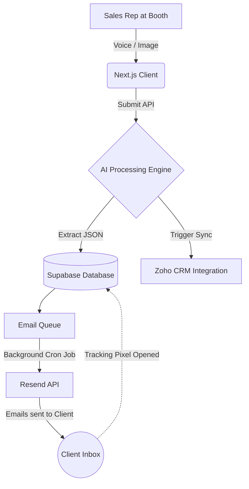

<div align="center">
  
  <h1>Apexora AI CRM</h1>
  <p><strong>The Next-Generation B2B Lead Capture & Autonomous Follow-up Engine</strong></p>
  <p>
    <a href="https://apexora-ai.vercel.app/login"><strong>Live Demo</strong></a>
    ·
    <a href="#-features"><strong>Features</strong></a>
    ·
    <a href="#%EF%B8%8F-tech-stack"><strong>Tech Stack</strong></a>
  </p>
</div>

<br />

## 🚀 Overview

**Apexora AI CRM** is an enterprise-grade, AI-native platform designed to redefine how sales teams capture, process, and engage with leads at trade shows, conferences, and networking events. 

Say goodbye to manual data entry and generic mass emails. Apexora leverages state-of-the-art Artificial Intelligence (Google Gemini) to seamlessly extract data from business cards and voice dictations, instantly grade leads, and automatically orchestrate hyper-personalized, multi-touch email drip campaigns.

---

## ✨ Core Features

### 🎙️ Intelligent Lead Capture (The 4-Step Wizard)
Built for the chaos of the exhibition floor, our capture engine ensures data entry happens in seconds.
* **AI Business Card OCR:** Simply snap a photo of a business card. The AI engine instantly extracts the Name, Company, Email, Phone, and Job Title with pinpoint accuracy.
* **Rapid Context Notes:** Add quick text notes about the lead's specific interests to inform follow-ups.
* **Voice Dictation:** Speak naturally into your device to record a voice memo. The AI automatically transcribes speech and extracts structured JSON data (Name, Company, Intent, Tone).
* **Instant Review & Submit:** Review the AI-extracted data and save the lead instantly to your cloud database.

### 🧠 Automated Lead Scoring & Intelligence
* **AI Lead Grading:** The platform automatically analyzes the lead's job title and context notes to assign a priority score: **Hot**, **Warm**, or **Cold**.
* **Rich Profiles:** Every lead profile displays a clean timeline of when they were captured, their associated campaign, and all attached notes and transcripts.

### ✉️ Adaptive Email Engine (E1S1 / E1S2 Architecture)
The core brain of the CRM handles all post-event communication autonomously.
* **Intelligent Subject Rotation:** Uses E1S1 (Email 1, Subject 1). If a lead ignores it, the system automatically sends E1S2 (same content, more attractive subject line).
* **Smart Drafting:** Gemini AI reads transcription notes and drafts highly personalized emails (e.g., "Great chatting with you about X at the booth...").
* **Cold Lead Filtering & Hot Lead Progression:** Automatically halts sequences for unresponsive leads while progressing engaged leads who open your emails.
* **Tracking & Analytics:** Native email open tracking via pixel injection automatically upgrades lead status to "Hot" when engagement is detected.

### 🔗 Enterprise Integrations
Data flows seamlessly into your existing enterprise stack.
* **Zoho CRM Sync:** A dedicated background service automatically pushes new leads and custom fields (like `exhibition` and `stall`) directly into Zoho CRM.
* **Google Sheets Fallback:** Ensures zero data loss by automatically logging leads in Google Sheets if external APIs experience downtime.

### 🔐 Security & Multi-Tenancy
* **Dynamic Multi-Tenancy:** Users are assigned an `organization_id` ensuring data isolation across organizations.
* **Supabase Authentication:** Fully secured using Supabase Server-Side Rendering (SSR) Authentication.
* **Row Level Security (RLS):** Physical database-level enforcement rejects unauthorized data access instantly.

---

## 🛠️ Tech Stack

* **Framework:** [Next.js 16](https://nextjs.org/) (App Router, Server Actions)
* **Language:** TypeScript
* **Styling:** [Tailwind CSS](https://tailwindcss.com/) & Framer Motion
* **Database & Auth:** [Supabase](https://supabase.com/) (PostgreSQL, RLS)
* **AI Engine:** Google Gemini (OCR, NLP, Generative Drafting)
* **Email Provider:** Nodemailer / [Resend](https://resend.com/)
* **State/Workflow:** LangGraph / LangChain

---

## 💻 Local Setup

1. **Clone the repository:**
   ```bash
   git clone https://github.com/Avrsxvr/AI-CRM.git
   cd AI-CRM
   ```

2. **Install dependencies:**
   ```bash
   npm install
   ```

3. **Configure Environment Variables:**
   Create a `.env.local` file and populate it with your API keys:
   ```env
   NEXT_PUBLIC_SUPABASE_URL=your_supabase_url
   NEXT_PUBLIC_SUPABASE_ANON_KEY=your_supabase_anon_key
   SUPABASE_SERVICE_ROLE_KEY=your_service_role_key
   
   GEMINI_API_KEY=your_gemini_key
   
   ZOHO_CLIENT_ID=your_zoho_client_id
   ZOHO_CLIENT_SECRET=your_zoho_client_secret
   ZOHO_REFRESH_TOKEN=your_zoho_refresh_token
   
   GMAIL_USER=your_gmail_address
   GMAIL_APP_PASSWORD=your_app_password
   ```

4. **Run the development server:**
   ```bash
   npm run dev
   ```
   Open [http://localhost:3000](http://localhost:3000) to view the application.

---

## 🏗️ System Architecture Workflow



---

<div align="center">
  <p>Developed with ❤️ for seamless trade show execution.</p>
</div>
