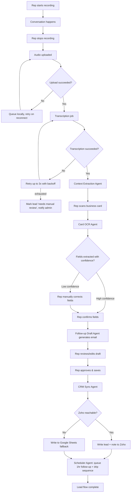
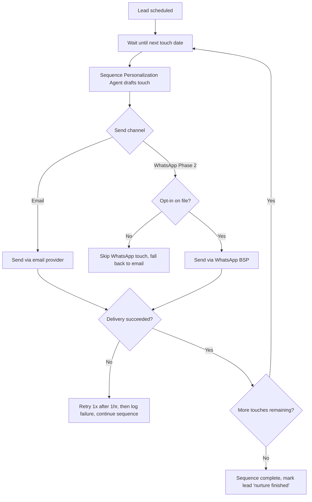

# 5. Workflow Document

## Workflow 1: Lead Capture (Card + Audio → CRM Record)

## Workflow 2: Drip Sequence Execution (per lead, over 3-4 months)

## Approval Path
The only mandatory human-in-the-loop checkpoint in MVP is the **first follow-up email**, reviewed and approved by the rep before it's queued. All subsequent drip touches send automatically once that first approval establishes the baseline tone/content was acceptable to the rep.

## Exception Path (system-wide)
Any agent failure that exhausts its retry budget marks the lead with a `needs_attention` flag visible on the admin dashboard, rather than silently dropping the lead or blocking the rep's next capture.
