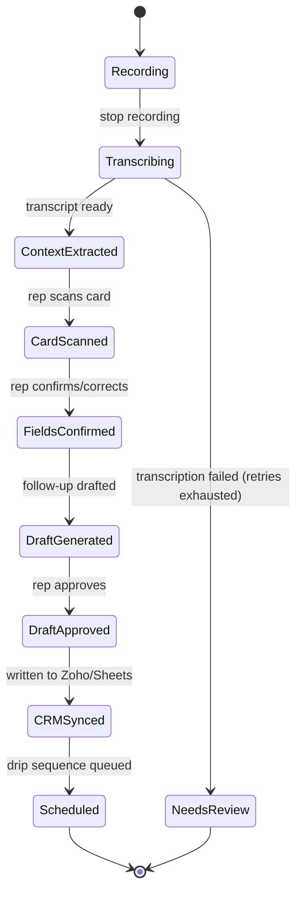

# 7. Multi-Agent Orchestration

*Assumption: orchestration is implemented as a LangGraph graph, consistent with the developer's existing tooling focus.*

## Planner Agent
For MVP scope, there is no separate dynamic planner — the workflow is a fixed, well-defined pipeline (capture → extract → confirm → sync → schedule), so a hardcoded LangGraph graph replaces the need for a general-purpose planning agent. Revisit if Phase 2 introduces open-ended tasks (e.g., a rep asking "draft a proposal for this lead" in natural language).

## Coordinator Agent
The LangGraph graph itself acts as the coordinator: each node (agent) reads from and writes to a shared graph state object (`lead_capture_state`), and edges define the fixed sequence with conditional branches (e.g., Zoho-reachable vs. fallback).

## Worker Agents
Context Extraction, Card OCR, Follow-up Draft, CRM Sync, Scheduler, Sequence Personalization (see Section 6) — each is a single-purpose node with a narrow input/output contract.

## Communication
Agents communicate exclusively through the shared graph state — no direct agent-to-agent calls. This keeps each node independently testable and replaceable (e.g., swapping the CRM Sync node's target from Zoho to another CRM later doesn't touch any other node).

## Task Delegation
Delegation is static (graph-defined), not dynamic, for MVP — appropriate given the fixed, well-understood workflow. A dynamic planner/delegator is a Phase 2+ consideration only if the product grows beyond this single linear flow.

## State Transitions

## Agent Collaboration
Context Extraction and Card OCR run independently (no shared dependency) and can execute in parallel once their respective inputs (transcript, card image) are available — see Concurrency below. Follow-up Draft depends on both completing first.

## Concurrency
- Card OCR can run **as soon as** the card is photographed — it does not need to wait for transcription to finish
- Context Extraction depends only on the transcript being ready

## Parallel Execution
Recommended: kick off Card OCR immediately on photo capture, in parallel with the (typically longer-running) transcription + context extraction pipeline for the audio. This shortens the rep's total wait time before seeing a follow-up draft.

## Sequential Execution
Follow-up Draft Agent must wait for **both** parallel branches (context + card fields) to complete before running. CRM Sync must wait for rep approval of the draft. Scheduler must wait for CRM Sync to succeed (needs a valid record ID to attach jobs to).

## Failure Recovery
Each node has its own retry policy (see Section 6). A node that exhausts retries flags the lead `needs_attention` rather than halting the whole graph — the rep can move on to the next lead immediately even if one lead's transcription needs manual follow-up later.
