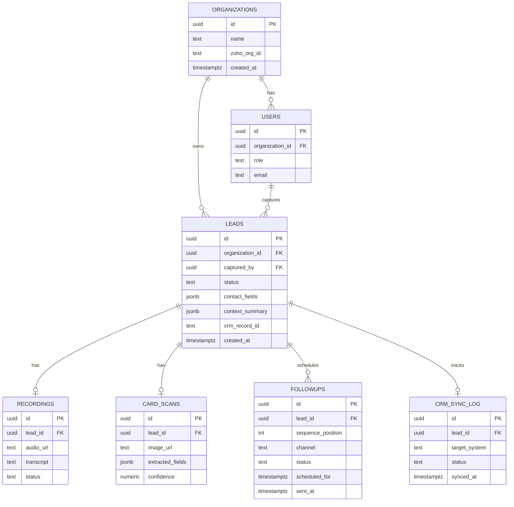

# 10. Database Design

*Platform: Supabase (Postgres). Schema below covers MVP scope; Phase 3 multi-tenant scale would add stricter partitioning (see Partitioning below).*

## ER Diagram

## Tables, Columns, Constraints
- `organizations`: one row per client (single row for MVP, structured for future multi-tenant growth)
- `users`: `role` constrained to `('rep','admin')`
- `leads`: `status` constrained to `('capturing','extracted','confirmed','synced','needs_attention')`; `contact_fields`/`context_summary` as `jsonb` for schema flexibility during early iteration
- `recordings`, `card_scans`: 1:1 with `leads` (one recording, one card per lead in MVP scope)
- `followups`: 1:many with `leads` (the drip sequence), `channel` constrained to `('email','whatsapp')`
- `crm_sync_log`: append-only audit trail of every sync attempt (Zoho or Sheets), for debugging fallback behavior

## Indexes
- `leads(organization_id, created_at)` — dashboard listing
- `leads(status)` — finding `needs_attention` leads
- `followups(scheduled_for, status)` — scheduler job pickup
- `leads(crm_record_id)` — dedup/lookup on re-sync

## Relationships
All foreign keys `ON DELETE CASCADE` from `leads` downward (deleting a lead removes its recording/scan/followups) except `crm_sync_log`, which is retained (`ON DELETE SET NULL`) for audit purposes even if a lead is later purged.

## Partitioning
Not required at MVP volume (hundreds of leads). If the product reaches multi-tenant SaaS scale (Section 1 vision), partition `leads` and `followups` by `organization_id` or by month of `created_at` to keep the scheduler's hot-path query fast.

## Archival Strategy
Raw audio files in object storage: retain 90 days post-event by default, then archive to cold storage or delete per client's data-retention preference (ties to Security §PII Protection). Lead/CRM records themselves persist indefinitely unless the client requests deletion.
