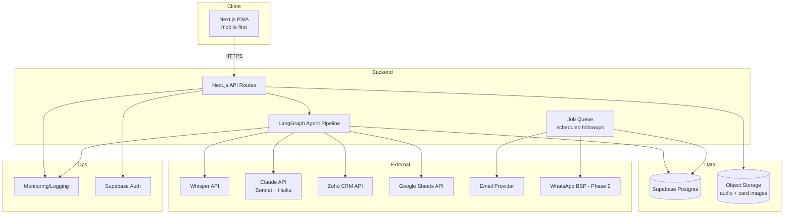

# 14. System Architecture

## Layer Summary
- **Frontend**: Next.js, mobile-first PWA (no install required, per earlier app-vs-website decision)
- **Backend**: Next.js API routes host both the request/response API and trigger the LangGraph pipeline
- **Agent Layer**: LangGraph graph (Section 6/7)
- **Database**: Supabase Postgres
- **Queue**: scheduled-job mechanism for followup timing (lightweight — see Infrastructure for build-vs-buy tradeoff)
- **Cache**: client-side only at MVP scale (see Memory Architecture §Cache Strategy)
- **Object Storage**: Supabase Storage for audio/card images
- **Monitoring**: see Section 21
- **Authentication**: Supabase Auth
- **Notification Services**: email provider (+ WhatsApp BSP, Phase 2)
- **External APIs**: Whisper, Claude, Zoho, Sheets, email provider

## Deployment Architecture
Single-region deployment (Vercel for frontend/API, Supabase managed Postgres) is sufficient for MVP — a single-client, event-driven (bursty around exhibition dates) usage pattern does not justify multi-region infrastructure. Revisit only under the Phase 3 multi-tenant SaaS vision.
