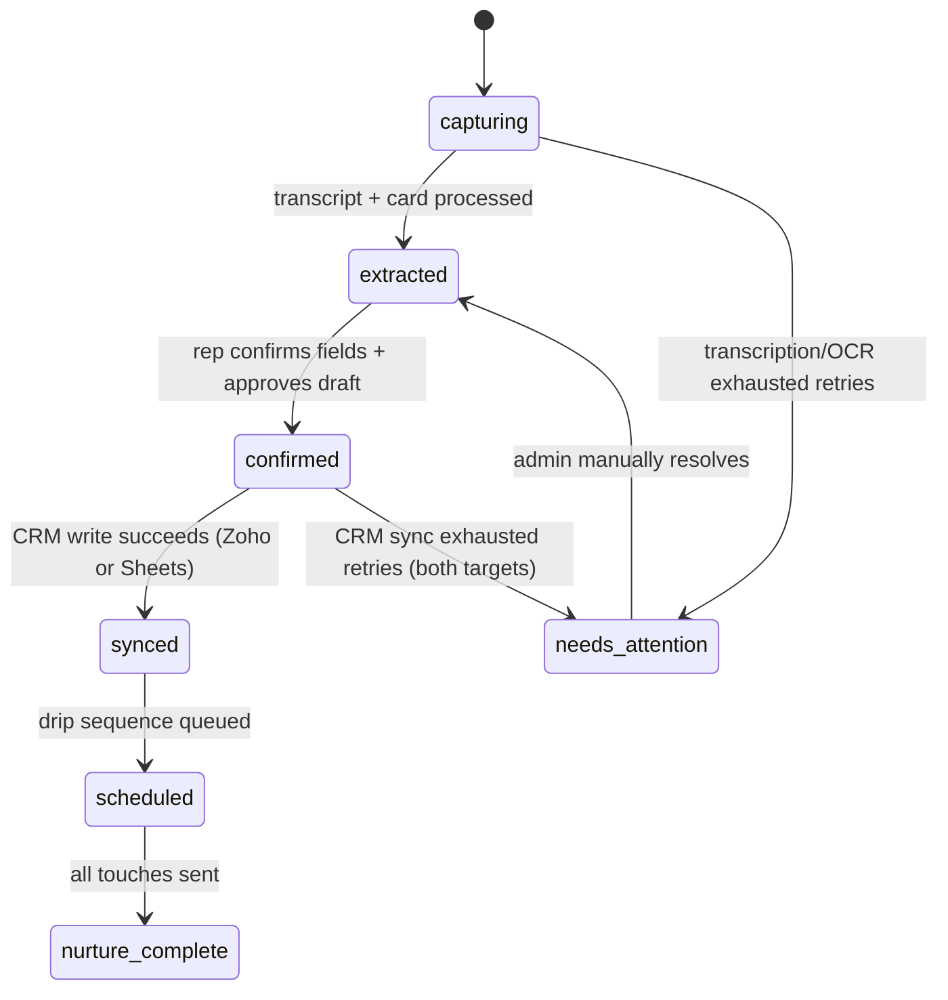
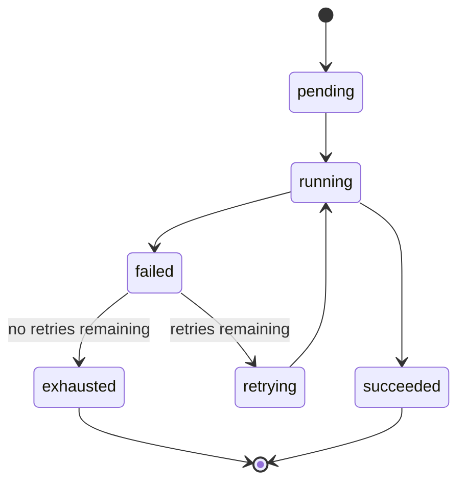
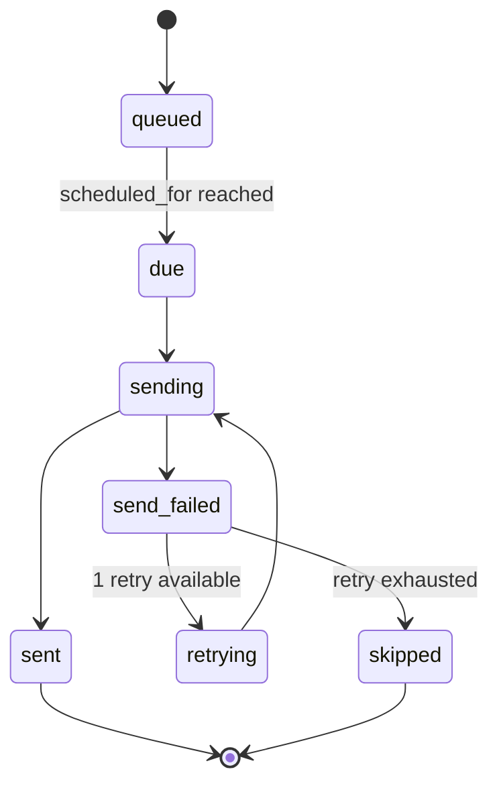
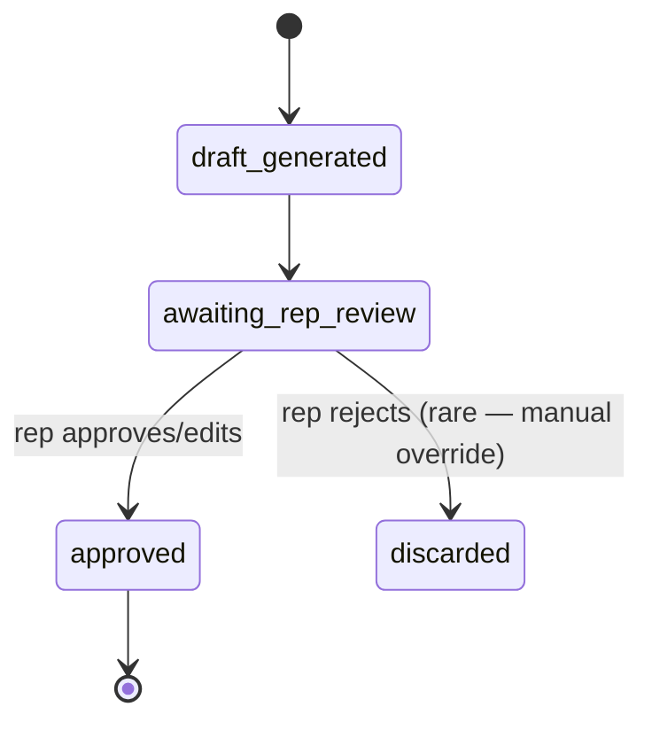

# 20. State Machine

## System-level: Lead Status

## Agent-level (per pipeline node)

## Task/Job (Scheduler)

## Approvals

## Failures/Retries
Failure and retry states are embedded within the Agent-level state machine above rather than modeled as a separate top-level machine — every node in the pipeline follows the same pending → running → (succeeded | failed → retrying/exhausted) pattern, keeping the mental model consistent across all six agents.
