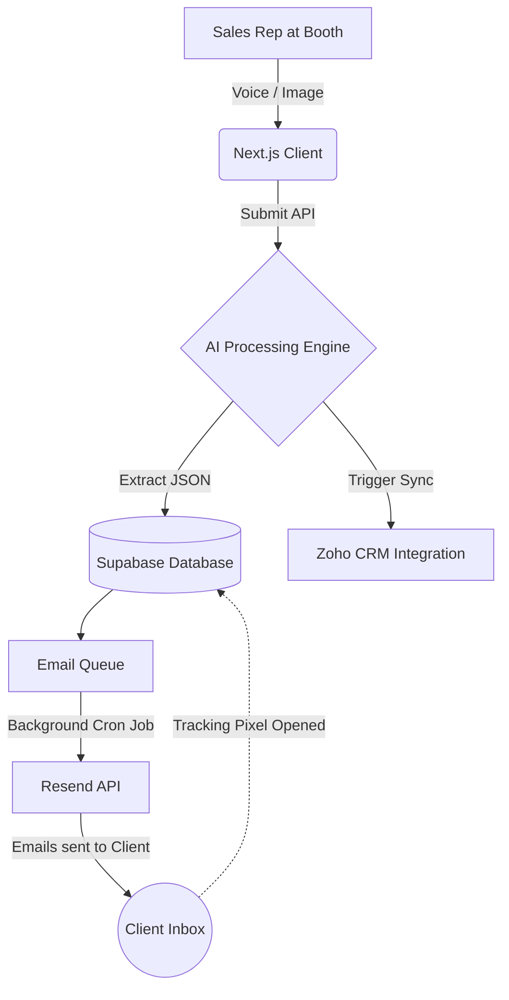

# 🚀 AI CRM: Current System Features
This document serves as the master feature list of all working components built into the AI CRM to date.

---

## 🔐 1. Authentication & Enterprise Security
The application is fully secured using **Supabase SSR (Server-Side Rendering) Authentication**, ensuring complete data privacy across organizations.

- **Dynamic Multi-Tenancy**: Users are assigned an `organization_id` in the database. All API routes dynamically fetch this ID to ensure data isolation.
- **Row Level Security (RLS)**: The database itself enforces security. Even if a bug existed in the API, the database physically rejects unauthorized data access.
- **Next.js Middleware**: A robust middleware intercepts every page load, bouncing unauthenticated users back to `/login` instantly.
- **Sandbox Testing Mode**: A frontend bypass exists for rapid prototyping without needing email verifications.

---

## 🎯 2. Intelligent Lead Capture
We replaced traditional manual data entry with state-of-the-art AI capture methods.

### 🎙️ Audio Dictation (Voice)
Sales reps can tap a microphone and speak naturally into their device.
- **WebRTC Audio Stream**: Captures high-quality audio directly from the browser.
- **AI Audio Processing**: Automatically transcribes speech and extracts structured JSON (Name, Company, Intent, Tone) using Google Gemini AI.

### 📇 Business Card Scanner
- Users can snap a picture or upload an image of a business card.
- **Optical Character Recognition (OCR)** powered by AI instantly extracts Phone Numbers, Emails, Job Titles, and Names with high accuracy.

---

## ✉️ 3. Autonomous Drip Sequences & AI Follow-ups
The core brain of the CRM handles all post-event communication automatically.

> [!TIP]
> Our **Sequence Personalization Agent** ensures no two emails look exactly alike, increasing deliverability and reply rates.

- **Automated Drafting**: Gemini AI reads the transcription notes and automatically writes highly personalized emails (e.g., "Great chatting with you about X at the booth...").
- **Smart Scheduling**: When a lead is captured, a sequence of touches (e.g., Email 1 tomorrow, Email 2 next week) is automatically queued up.
- **Email Dispatching**: Integrated with **Resend** to send emails reliably.
- **Tracking & Analytics**: Tracks exactly when a recipient opens an email via a hidden tracking pixel, upgrading their lead status to "Hot" automatically.

---

## 🔗 4. External Integrations
Data flows seamlessly into your existing enterprise stack.

### 📊 Zoho CRM Sync
- A dedicated background service (`ZohoService`) automatically pushes new leads directly into your Zoho CRM via API.
- Captures custom fields like `exhibition` and `stall` for precise trade show tracking.

### 📉 Google Sheets Fallback
- If Zoho's API goes down or rate-limits you, the system automatically falls back to logging the lead in Google Sheets so zero data is ever lost.

---

## 🛠️ 5. Admin Test Lab (Internal Tooling)
To ensure rapid development and reliable testing, we built an internal developer dashboard.

- Located at `/test-lab`, this UI allows administrators to:
  - Instantly trigger the **Cron Job** to process the email queue without waiting for the 5-minute timer.
  - Manually fire test webhooks.
  - View real-time logs of background processing successes and failures.

---

## 🏗️ System Architecture Workflow

> [!IMPORTANT]
> **What's Next? (Phase 3)**: We are currently preparing to implement advanced Message Queuing (Upstash) to ensure background jobs never crash under heavy loads, and Bi-directional Zoho Syncs (so changes in Zoho reflect back into our app).
